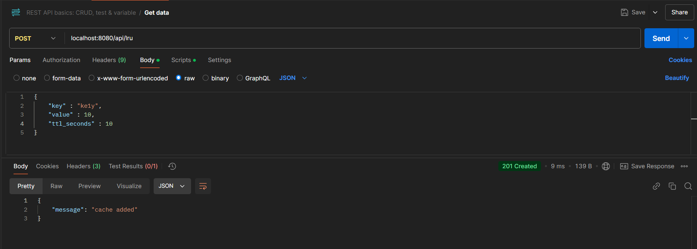

# lru-cache

## Обзор
Сервис Кэширования - это сервис на Go,предоставляющий возможность кешировать данные по стратегии LRU. Данные будут храниться в оперативной памяти процесса (подробности ниже). Эта документация предоставляет обзор сервиса, его API-эндпоинтов и как настроить и запустить его.

## Задача:
- [ ] LRU-кэш реализован и удовлетворяет описанному интерфейсу
- [ ] LRU-кэш потокобезопасен
- [ ] LRU-кэш поддерживает удаление данных по TTL
- [ ] TTL обновляется при записи данных под уже существующим ключом
- [ ] LRU-кэш соответствует требованиям по временной сложности операций
- [ ] Реализован обработчик `POST /api/lru`
- [ ] Реализован обработчик `GET /api/lru/{key}`
- [ ] Реализован обработчик `GET /api/lru`
- [ ] Реализован обработчик `DELETE /api/lru/{key}`
- [ ] Реализован обработчик `DELETE /api/lru`
- [ ] Приложение конфигурируется согласно описанной политике
- [ ] Приложение поддерживает все параметры конфигурации (адрес запуска, TTL по умолчанию, размер кэша, уровень логирования)
- [ ] Сервис пишет логи
- [ ] Каждая запись в лог содержит: уровень логирования, время события, логируемое сообщение
- [ ] Сервис логирует каждый входящий запрос: на уровне `DEBUG`, с указанием обработчика, с указанием времени, затраченного на обработку
- [ ] Для всех пакетов приложения и всех экспортируемых объектов написана документация в формате `godoc`
- [ ] Покрытие кода тестами не ниже 40% (скрипт для расчета покрытия приведен выше)
- [ ] Код приложения организован согласно `Standard Go Project Layout`
- [ ] (*) Сервис поддерживает `graceful shutdown` в ответ на `SIGINT` и `SIGTERM`
- [ ] В репозитории присутствует Dockerfile, позволяющий запустить сервис в docker-контейнере

### Используемые технологии:

- Go
- сhi framework - для API хандлера
- env,godotenv - для конфигурации
- slog - для логирования
- Docker
- Postman

## Содержание

1. [Конфигурация](#конфигурация)
2. [Запуск Сервиса](#запуск-сервиса)
3. [API Эндпоинты](#api-эндпоинты)
   - [Put](#put)
   - [Get](#get)
   - [Get All](#get-all)
   - [Evict](#evict)
   - [Evict All](#evict-all)


## Конфигурация

### Флаги:
При запуске Go приложения можно использовать перечисленные флаги
```
  -cache-size int
        Maximum cache size (default 10)
  -default-cache-ttl duration
        Default TTL for cache entries ms,s,m,... (default 1m0s)
  -log-level string
        Log level (e.g., DEBUG, INFO, WARN, ERROR) (default "DEBUG")
  -server-host-port string
        Address to run the server (e.g., localhost:8080) (default "localhost:8080")
```

Конфигурация сервиса указана в файле local.env в виде переменных окружения.
Подробно можно посмотреть и поменять в файле
``` 
config/local.env
```
#### Пример:
```dotenv
   SERVER_HOST_PORT : ":8080"
   CACHE_SIZE : 10
   DEFAULT_CACHE_TTL : 60s
   LOG_LEVEL : DEBUG
```

Если отсутствует файл переменных окружения будут использоваться конфигурация по умлочанию: 
### Config by default
```dotenv
   SERVER_HOST_PORT : ":8080"
   CACHE_SIZE : 10
   DEFAULT_CACHE_TTL : 60s
   LOG_LEVEL : WARN
```

## Запуск сервиса

1. Клонируем репозиторий в вашу рабочую директорию:
```
git clone https://github.com/instinctG/lru-cache.git
```

Запустить сервис можно 2 способами:

- Сбилдить go программу
- Использовать dockerfile и запустить docker контейнер


Перед запуском сервиса можете задать переменную окружения CONFIG_PATH откуда будут грузиться переменные окружения для работы сервиса:
```
export CONFIG_PATH="config/local.env"
```
Либо поменять расположение переменных окружения и задать собственный путь.


### Первый способ
задать CONFIG_PATH(не обязательно).
```sh
export CONFIG_PATH="config/local.env"
```
Если CONFIG_PATH не задан,то будет использоваться [конфигурация по умолчанию](#Config-by-default)

Сбилдить приложение :
```sh
go build -o lru cmd/app/main.go
```

Запуск сервиса ([можно задать флаги](#флаги)):
```
./lru
```

Завершить работу сервиса(graceful-shutdown)
```
Ctrl+C
```

### Второй способ
### Dockerfile:
Сбилдить docker контейнер:
```sh
docket build -t lru .
```

Запуск контейнера:
```
docker run -e CONFIG_PATH="path-to-your-config-file" -p 8080:8080 lru
```

в флаге -e также можно задать другие переменные окружения [из перечисленного](#Config-by-default).

Для пути конфигурации используем CONFIG_PATH="local.env" так как, так задал в Dockerfile(можете поменять расположение конфиг файла при сборке docker,задав в самом Dockerfile.

Если CONFIG_PATH не задан,то используем [конфигурацию по умолчанию](#config-by-default)

Завершить работу сервиса(graceful-shutdown)
```
Ctrl+C
```


Ниже предоставлена информация по эндпоинтам, а также примеры взаимодействия с API.


## Логирование 

#### Пример логирования при запуске сервиса без заданного CONFIG_PATH(будут использоваться дефолтные конфиги):

Будет отображаться только WARN уровень и ниже,для более подробных логов лучше запускать на уровне DEBUG 


### Пример логирования при успешном запуске сервиса
### go build:


#### Docker container:
Для docker контейнера не удалось запустить с цветами для красочности)


### Покрытие тестами

- Написал unit,mock,table driven тесты 

>51,8%
## API Эндпоинты

Сервис предоставляет следующие API-эндпоинты:

### Put

- **Эндпоинт**: `/api/lru`
- **Метод**: POST
- **Описание**: Добавляет в кэш элемент с ключом и TTL(default если не задано).

- **Тело запроса**: JSON
#### пример
```json
{
   "key": "123",
   "value": 123
}

```
#### Пример запроса
```
POST http://localhost:8080/api/lru
```
#### Пример ответа(Если все поля введены корректно)


#### Тело ответа
```json
{
    "message": "cache added"
}
```

### Get

- **Эндпоинт**: `/api/lru/{key}`
- **Метод**: GET
- **Параметры**:
    - `key`: Имя ключа (пример. `"2"`).
```
POST http://localhost:8080/api/lru/key
```
- **Описание:** Получает кэш с указанным ключом 


#### Пример ответа(Если ключ введен верно)

Ответ:
```json
{
  "key": "2",
  "value": 1,
  "expires": 1735882118
}
```


### Get All

- **Эндпоинт**: `/api/lru`
- **Метод**: GET
```
GET http://localhost:8080/api/lru
```
- **Описание**: Получает список всех ключей и значении кэша.

#### Postman:


#### Пример ответа(Если кэш есть в оперативной памяти)

```json

  {
    "keys": ["1", "2", "3", "4", "5"],
    "values": [1, 1, 1, 1, 1]
  }

```
***
### Evict

- **Эндпоинт**: `/api/lru/{key}`
- **Метод**: DELETE
```
DELETE http://localhost:8080/api/lru/key
```
- **Описание**: Удаляет кэш с заданным ключом.

#### Пример


Возможные ответы сервера:
`204` - успешное удаление


`404` - ключ не найден

```json
 {
  "error": "key not found"
}
```

***
### Evict All

- **Эндпоинт**: `/api/lru`
- **Метод**: DELETE
- **Описание**: Полная очистка кэша.

#### Пример:

```
DELETE http://localhost:8080/api/lru
```

Возможные ответы сервера:
1. `204` - успешная очистка кэша


